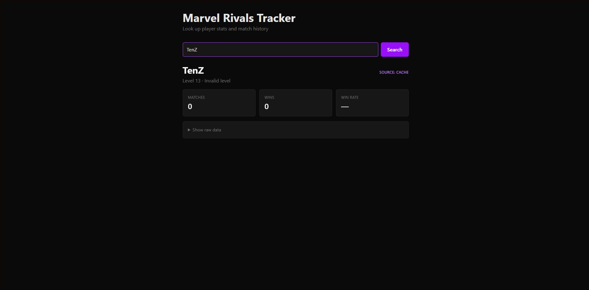

# Marvel Rivals Performance Tracker

A full-stack web app for looking up Marvel Rivals player stats, built with a Flask backend, SQLite cache layer, and React frontend.

**🔗 Live demo: [marvel-rivals-tracker-beta.vercel.app](https://marvel-rivals-tracker-beta.vercel.app)**

> Heads up: the backend is hosted on Render's free tier, which spins down after 15 minutes of inactivity. The first request after a cold start can take 30–60 seconds while the service boots up. Subsequent requests are fast.



## What it does

- Look up any Marvel Rivals player by username
- View their level, rank, total matches, wins, and win rate
- Cached responses serve in under 50ms; fresh API lookups take ~5–10s
- Handles private profiles and missing data gracefully

## Tech stack

**Backend:** Python 3.12, Flask, Flask-CORS, SQLite, requests, python-dotenv, gunicorn  
**Frontend:** React 19, Vite, Tailwind CSS v4  
**Infrastructure:** Render (backend), Vercel (frontend), infrastructure-as-code via `render.yaml`  
**External:** marvelrivalsapi.com (third-party data API)

## Architecture

The project follows a separation-of-concerns pattern across three backend modules and a component-based frontend.

```
marvel-rivals-tracker/
├── backend/
│   ├── app.py            # Flask routes, request orchestration
│   ├── api_client.py     # External API integration with timeouts and custom exceptions
│   ├── db.py             # SQLite schema and cache read/write functions
│   └── data/             # SQLite database (gitignored)
├── frontend/
│   └── src/
│       ├── App.jsx
│       └── components/
│           ├── SearchBar.jsx
│           ├── PlayerCard.jsx
│           ├── LoadingCard.jsx
│           └── ErrorMessage.jsx
└── render.yaml           # Render deployment config (infrastructure-as-code)
```

### How caching works

The backend uses a cache-aside pattern: every player lookup first checks the local SQLite database. If the cached entry exists and is fresh (within a 1-hour TTL), it's returned immediately. On cache miss or stale data, the backend fetches from the external API, saves the response to SQLite, and returns the fresh data.

This dramatically reduces redundant API calls — repeat lookups for the same player resolve in tens of milliseconds instead of seconds, and the app remains usable when the upstream API is rate-limited or temporarily down for cached players.

### How deployment works

The backend is deployed to Render via a `render.yaml` blueprint, which declares the service config (Python runtime, gunicorn start command, environment variables) in version control rather than dashboard clicks. The frontend is deployed to Vercel from the `frontend/` subdirectory using its native Vite preset.

CORS is configured via the `ALLOWED_ORIGINS` environment variable, restricting cross-origin requests to the production Vercel domain. The frontend reads its API base URL from a Vite environment variable (`VITE_API_BASE`), which lets the same codebase target localhost in development and the live Render URL in production.

## Running locally

You'll need Python 3.10+ and Node.js 18+.

### Backend

```powershell
cd backend
python -m venv venv
.\venv\Scripts\Activate.ps1   # On Mac/Linux: source venv/bin/activate
pip install -r requirements.txt
```

Create a `.env` file in `backend/` with your marvelrivalsapi.com API key:
MARVEL_RIVALS_API_KEY=your_key_here

Then run the server:

```powershell
python app.py
```

The backend runs on http://127.0.0.1:5000.

### Frontend

```powershell
cd frontend
npm install
npm run dev
```

The frontend runs on http://localhost:5173.

## Notes

- This project consumes the marvelrivalsapi.com third-party API, which only has data for players who have been searched on their site. Some players return 404 if not yet indexed.
- Player profiles set to private in-game return a 403, which the app surfaces as a clean error message.

## Roadmap

- [x] Deployment to Render (backend) + Vercel (frontend)
- [ ] Match history view with hero, map, and KDA per match
- [ ] Hero performance breakdown (win rate per hero)
- [ ] Player comparison (side-by-side two players)

## Author

Built by Meet Patel as a portfolio project. CS undergrad at Wilfrid Laurier University.

[GitHub](https://github.com/MPatel2110) · [LinkedIn](https://www.linkedin.com/in/meet-patel-878187243/)
